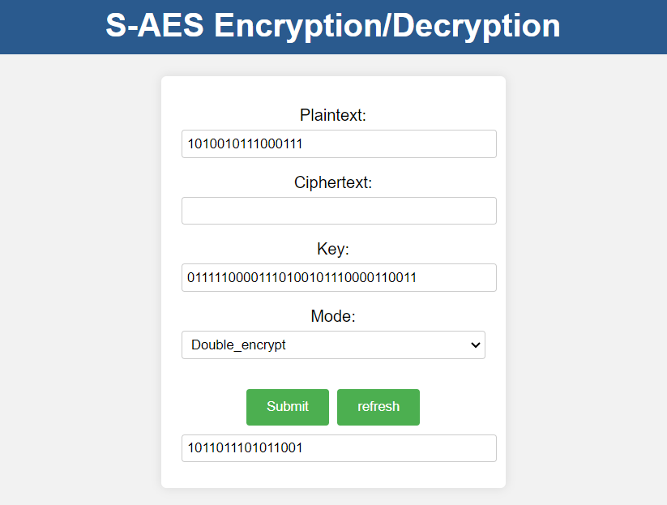

## S-AES测试结果

## 第1关：基本测试
根据S-AES算法编写和调试程序，提供GUI解密支持用户交互。输入可以是16bit的数据和16bit的密钥，输出是16bit的密文。

## 第2关：交叉测试
### 第一轮
输入明文为：1001101010110010
输入密钥为：0110101110001101
加密结果为：1100000001000010
#### 我方：

#### 对方：

### 第二轮
输入明文为：1010011100111011
输入密钥为：0110111101101011
加密结果为：1001010100011101
#### 我方：

#### 对方：

### 第三轮
明文：1100110000110011
密钥：1010101010101010
加密结果：0010110011010000
#### 我方：

#### 对方：

## 第3关：扩展功能
加密算法的数据输入可以是ASII编码字符串(分组为2 Bytes)，对应地输出也可以是ACII字符串(很可能是乱码)。
### 加密：

### 解密

## 第4关：多重加密
### 1、双重加密将S-AES算法通过双重加密进行扩展，分组长度仍然是16 bits，但密钥长度为32 bits
#### 双重加密

#### 双重解密

### 2、中间相遇攻击假设你找到了使用相同密钥的明、密文对(一个或多个)，请尝试使用中间相遇攻击的方法找到正确的密钥Key(K1+K2)

### 3、三重加密将S-AES算法通过三重加密进行扩展，下面两种模式选择一种完成：
#### (1)按照32 bits密钥Key(K1+K2)的模式进行三重加密解密，
#### (2)使用48bits(K1+K2+K3)的模式进行三重加解密。

## 第5关：工作模式
### 在CBC模式下进行加密，并尝试对密文分组进行替换或修改，然后进行解密，请对比篡改密文前后的解密结果。
#### CBC模式下加密

#### CBC模式正常解密

#### 对密文分组进行替换或修改后解密

#### 1、密文分组替换或修改：
如果修改了中间的某个密文块，那么在解密时，这个块和下一个块都会被错误解密。因为被修改的密文块会影响其解密结果，并且还会作为IV（初始向量）影响下一个块的解密。
如果修改了最后一个密文块，那么只有最后一个块的解密会受到影响。
#### 2、对比篡改前后的解密结果：
篡改后的解密结果会在被修改的块和可能的下一个块出现错误的明文。
这种错误通常是随机的，并且很难从中恢复出有意义的信息。
因此，CBC模式对密文的完整性具有一定的保护作用，能够检测到密文是否被篡改。
 S-AES
